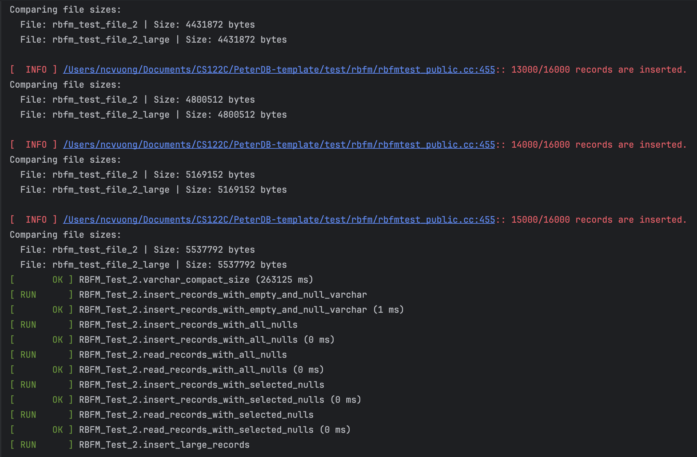
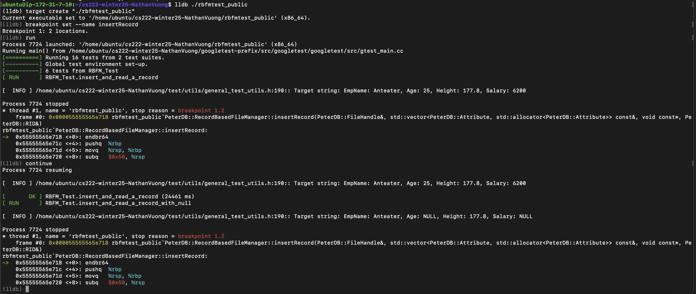
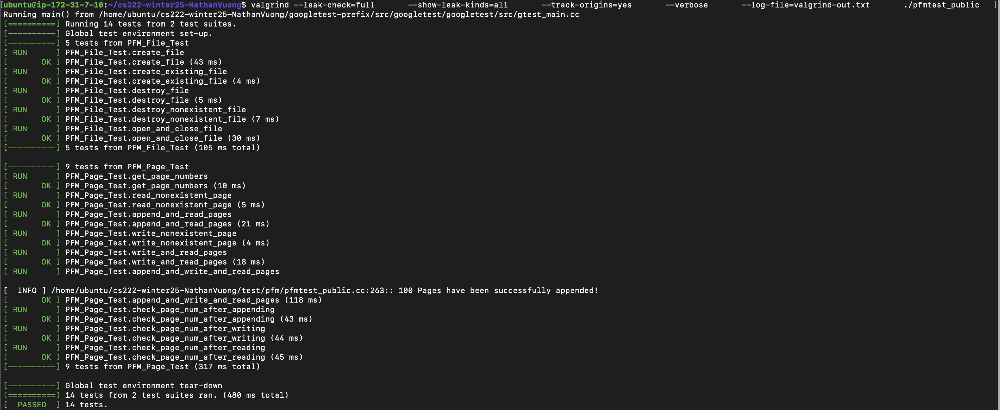
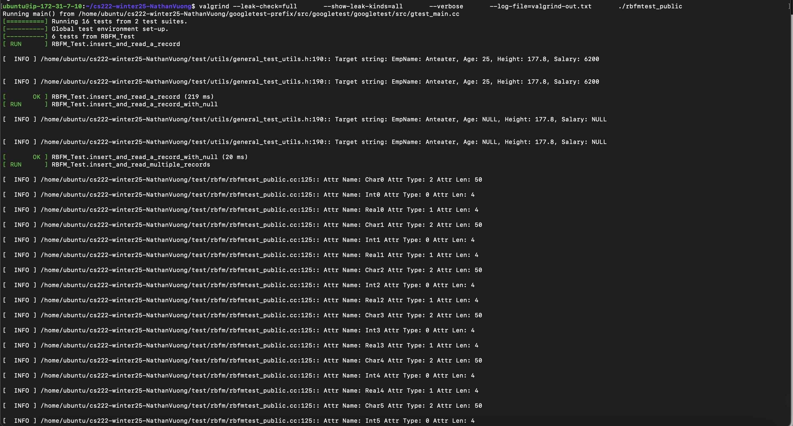

## Debugger and Valgrind Report

### 1. Basic information
 - Team #: 6 
 - Github Repo Link: https://github.com/NathanVuong/cs222-winter25-NathanVuong
 - Student 1 UCI NetID: ncvuong
 - Student 1 Name: Nathan Vuong
 - Student 2 UCI NetID (if applicable):
 - Student 2 Name (if applicable):

### 2. Using a Debugger
Describe how you use a debugger (gdb, or lldb, or CLion debugger) to debug your code and show screenshots. 
For example, using breakpoints, step in/step out/step over, evaluate expressions, etc. 
- I used the lldb debugger that came with CLion to work with the given test cases. I was struggling to pass the varchar_compact_size test case in particular, but by logging the sizes of the files being compared I was able to identify a pattern and fix the issue. I also used lldb in the AWS EC2 instance whilst I was working through constructing the createRecord method.
  
  

### 3. Using Valgrind
Describe how you use Valgrind to detect memory leaks and other problems in your code and show screenshot of the Valgrind report.
- Valgrind was helpful for me when I was debugging leftover memory I forgot to clean. In particular, I used it for createRecord in the RBFM when I was seemingly receiving what looked like random output to the test cases.
  
  